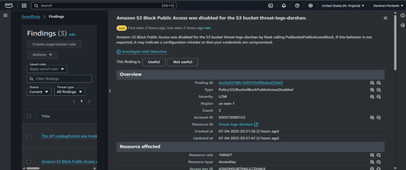
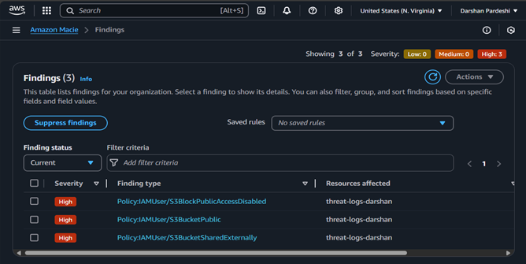

# AWS Cloud Threat Detection & Response Engine
A serverless pipeline to detect and respond to cloud threats (S3 exposures, port scans) using AWS native services.

## Features
- Real-time threat detection via **Amazon GuardDuty**, **Macie**, and **AWS Config**.
- Automated alerts using **Lambda**, **EventBridge**, and **SNS**.
- Log analysis with **Athena** and **CloudWatch**.
- Attack simulations (Nmap scans, S3 misconfigurations).

## Architecture

## Setup
1. **Prerequisites**: AWS account with permissions for GuardDuty, Lambda, etc.
2. **Deploy Lambda Function**:
   - Use the code in `code/lambda-functions/guardduty_alert_processor.py`.
3. **Configure EventBridge Rule**:
   - Deploy the rule from `code/eventbridge-rules/guardduty_to_sns_rule.json`.
4. **Enable AWS Services**:
   - GuardDuty, Macie, CloudTrail, VPC Flow Logs (see `docs/aws_services.md`).
5. **Simulate Attacks**:
   - Run scripts in `attack-simulations/`.

## Screenshots
| Detection | Alert | Investigation |
|-----------|-------|---------------|
|  |  |  |

## License
MIT